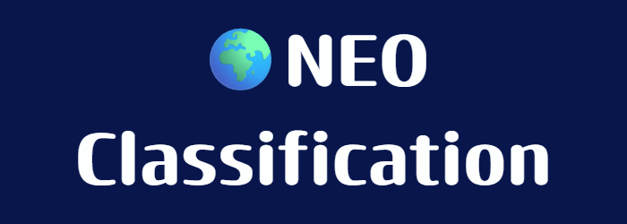

<div align="center">
  
  
  # NEOGuard: Near-Earth Object Hazard Classification
  
  <p><em>An advanced MLOps web application powered by Deep Learning and FastAPI for real-time planetary defense telemetry analysis.</em></p>

  [](https://www.python.org/)
  [](https://fastapi.tiangolo.com/)
  [](https://pytorch.org/)
  [](https://www.docker.com/)
  [](https://opensource.org/licenses/MIT)
</div>

---

* ## About The Project

**NEOGuard** is a production-ready, full-stack machine learning web application built to analyze and classify Near-Earth Objects (NEOs). By leveraging a Deep Neural Network trained on NASA telemetry data, the application evaluates physical telemetry parameters—such as estimated diameter, relative velocity, and absolute magnitude—to determine whether a celestial body poses a potential hazard to Earth.

---

* ## Tech Stack & Architecture

* **Backend:** FastAPI, Uvicorn, Pydantic
* **Machine Learning / Core:** PyTorch, Scikit-Learn, NumPy
* **Frontend:** HTML5, CSS3 (Modern Glassmorphism & Space Theme), Vanilla JavaScript
* **DevOps / MLOps:** Docker, `uv` (fast Python package installer & virtual environment manager)

---

* ## Setup & Installation using `uv`

This project utilizes [uv](https://github.com/astral-sh/uv) for lightning-fast virtual environment creation and package dependency management.

### 1. Clone the Repository
```bash
git clone [https://github.com/Gentle-pc-user/Deep_Learning_Models.git](https://github.com/Gentle-pc-user/Deep_Learning_Models.git)
cd Deep_Learning_Models/Nearest_Earth_Object_Classification
```

### 2. Create a Virtual Environment with uv
```bash
Bash
uv venv .venv
```
### 3. Activate the Virtual Environment
Windows (Command Prompt / PowerShell):

```bash
DOS
.venv\Scripts\activate
```
macOS / Linux:
```bash
Bash
source .venv/bin/activate
```
### 4. Install Dependencies Fast using uv
```bash
Bash
uv pip install -r requirements.txt
```

* ## Running the Application Locally
Start your FastAPI server using Uvicorn with auto-reload:
```bash
Bash
uvicorn app:app --reload
```

Open your web browser and navigate to:

Frontend UI: `http://127.0.0.1:8000`

API Documentation (Swagger UI): `http://127.0.0.1:8000/docs`

* ## Docker Containerization
To run the application inside an isolated Docker container, follow these steps:

1. Build the Docker Image
Ensure you are in the root project folder containing your `Dockerfile`, then run:

```bash
Bash
docker build -t neo-hazard-app .
```
2. Run the Container
```bash
Bash
docker run -p 8000:8000 neo-hazard-app
```
Open your browser at `http://127.0.0.1:8000` to access the containerized application.

* ## Dataset Reference
The underlying machine learning model is trained using telemetry features derived from the [NASA Nearest Earth Objects Dataset on Kaggle](https://www.kaggle.com/datasets/sameepvani/nasa-nearest-earth-objects).

* ## License
Distributed under the MIT License. See `LICENSE` for more information
